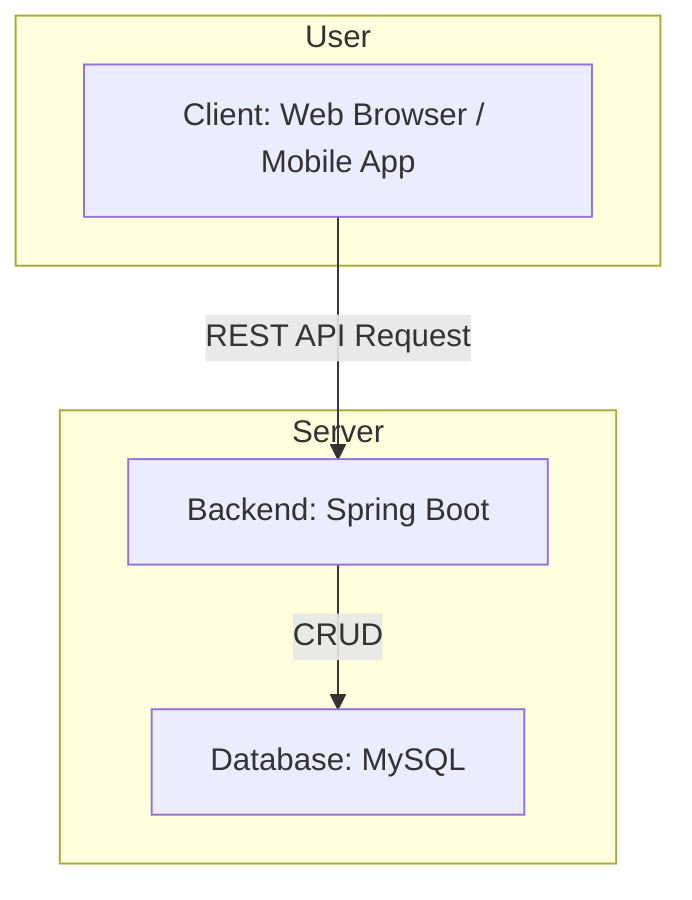

# Daylogue - 일상을 기록하고 관리하는 다이어리 서비스

<p align="center">
  
  
  
</p>

**Daylogue**는 사용자의 일정, 할 일, 메모 등을 체계적으로 기록하고 관리할 수 있는 웹 기반 다이어리 서비스입니다.

---

## 목차 (Table of Contents)
- [주요 기능 (Features)](#주요-기능-features)
- [시스템 아키텍처 (System-Architecture)](#시스템-아키텍처-system-architecture)
- [기술 스택 (Tech Stack)](#기술-스택-tech-stack)
- [시작하기 (Getting Started)](#시작하기-getting-started)
- [환경 변수 설정 (Environment Variables)](#환경-변수-설정-environment-variables)
- [프로젝트 구조 (Project Structure)](#프로젝트-구조-project-structure)
- [API 명세 (API Reference)](#api-명세-api-reference)
- [기여하기 (Contributing)](#기여하기-contributing)
- [문제 해결 / FAQ (Troubleshooting)](#문제-해결--faq-troubleshooting)
- [라이선스 (License)](#라이선스-license)
- [연락처 (Contact)](#연락처-contact)

---

## 주요 기능 (Features)

* **일정 관리:** 캘린더를 통해 월별, 주별, 일별 일정을 등록하고 관리합니다.
* **할 일 목록:** 우선순위에 따라 할 일을 관리하고 진행 상태를 추적합니다.
* **카테고리 설정:** 사용자가 직접 카테고리를 생성하여 일정을 분류할 수 있습니다.
* **테마 커스터마이징:** 라이트/다크 모드 등 다양한 테마를 적용할 수 있습니다.

> **Note:** 주요 화면의 스크린샷이나 시연 GIF는 `/docs/images` 폴더를 참조하십시오.
>
>

---

## 시스템 아키텍처 (System Architecture)



---

## 기술 스택 (Tech Stack)

### Backend
- 
- 
- 
- 

### Frontend
- 
- 
- 

### Database
- 

### Frontend (별도 Repository에서 관리)
- 
- 

---

## 시작하기 (Getting Started)

### 1. Prerequisites
* Java 17+
* MySQL 8.0+

### 2. Installation & Run

```bash
# 1. Repository 클론
git clone https://github.com/daylogue/daylogue.git
cd daylogue

# 2. Backend 실행
cd backend
./gradlew build
java -jar build/libs/daylogue-0.0.1-SNAPSHOT.jar

# 3. Frontend 실행
cd ../frontend
npm install
npm start

# 주요 의존성 설치
npm install axios react-router-dom http-proxy-middleware @stomp/stompjs sockjs-client
npm install antd @ant-design/icons @fullcalendar/react @fullcalendar/daygrid @fullcalendar/timegrid @fullcalendar/interaction
npm install moment date-fns date-fns-tz react-grid-layout react-resizable
npm install recharts lucide-react clsx tailwind-merge react-error-boundary styled-components react-tooltip sweetalert

# UI 프레임워크 및 스타일링 설정 (Tailwind & Shadcn)
npm install -D tailwindcss postcss autoprefixer
npx tailwindcss init -p
npx shadcn@latest init
npx shadcn@latest add checkbox select button input card dialog toast form message

# 개발 도구 설치
npm install --save-dev eslint @eslint/js globals eslint-plugin-react prettier vite-plugin-dts @types/node

# Github Pages 배포 가능 라이브러리
npm install gh-pages --save-dev

```

---

## 환경 변수 설정 (Environment Variables)

프로젝트를 실행하기 전에 `application.yml` 파일에서 데이터베이스 설정을 수정해야 합니다.

- **Backend (`/src/main/resources/application.yml`):**
  ```yaml
  spring:
    datasource:
      url: jdbc:mysql://localhost:3306/daylogue_db
      username: your_db_username
      password: your_db_password
  ```

---

## 프로젝트 구조 (Project Structure)

```
.. 다시 수정 예정 
```

---

## API 명세 (API Reference)

API 명세는 Swagger를 통해 제공됩니다. 백엔드 서버 실행 후 아래 주소로 접속하여 확인할 수 있습니다.

- **Swagger UI:** [http://localhost:8080/swagger-ui.html](http://localhost:8080/swagger-ui.html)

---

## 기여하기 (Contributing)

이 프로젝트에 기여하고 싶으시다면, 언제든지 환영합니다!

1.  이슈를 생성하여 개선점을 제안해주세요.
2.  Repository를 Fork하여 자신만의 브랜치를 생성합니다. (`git checkout -b feature/AmazingFeature`)
3.  변경 사항을 커밋합니다. (`git commit -m 'Add some AmazingFeature'`)
4.  브랜치에 Push합니다. (`git push origin feature/AmazingFeature`)
5.  Pull Request를 생성해주세요.

---

## 문제 해결 / FAQ (Troubleshooting)

- **Q: Backend 실행 시 `Connection refused` 오류가 발생합니다.**
  - **A:** `application.yml`의 데이터베이스 접속 정보(URL, username, password)가 올바른지, 로컬 MySQL 서버가 정상적으로 실행 중인지 확인해주세요.

- **Q: API 호출 시 403 Forbidden 오류가 발생합니다.**
  - **A:** JWT 토큰이 요청 헤더에 올바르게 포함되었는지 확인해주세요. 로그인이 필요한 API는 인증된 토큰이 필요합니다.

---

## 라이선스 (License)

이 프로젝트는 MIT 라이선스를 따릅니다. 자세한 내용은 `LICENSE` 파일을 참고하십시오.

---

## 연락처 (Contact)

- **Project Maintainer:** [정성원]
- **Email:** [jsw0115@github.com]
- **GitHub:** [https://github.com/daylogue]
